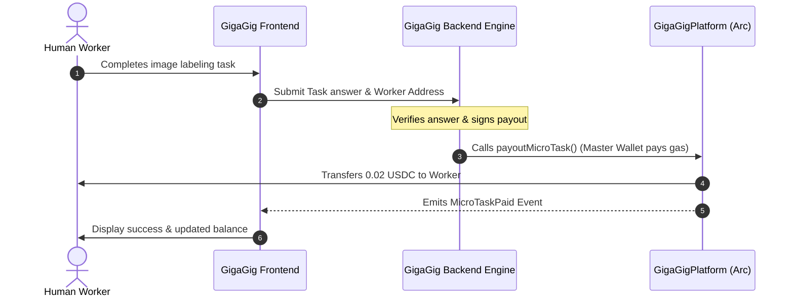
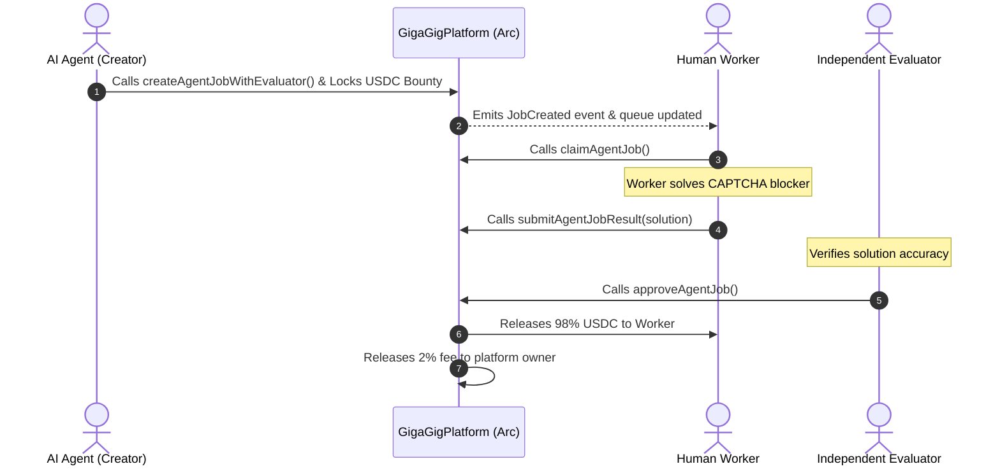

# 🚀 GigaGig (Global Micro-Task & AI Agent Economy)

**GigaGig** is a premium, state-of-the-art decentralized platform designed to solve the global payment bottleneck for micro-tasks and AI Agent crowdsourcing. By utilizing native USDC gas and sub-second finality on the **Circle Arc Testnet**, GigaGig enables sub-cent payments and streaming payouts for workers globally, bypassing traditional Web2 fee structures.

---

## 📸 Demo & Links
*   **Pitch & Demo Video:** *[Insert Video URL Here]*
*   **Platform Explorer:** [https://testnet.arcscan.app](https://testnet.arcscan.app)
*   **GigaGig Contract:** [`0xe8b0702eb6c1a4e4f769049444b2b6b7c35ae502`](https://testnet.arcscan.app/address/0xe8b0702eb6c1a4e4f769049444b2b6b7c35ae502)

---

## 1. Traditional Problems

*   **Global Payment Bottleneck:** Freelancers in developing countries frequently execute data-labeling or validation tasks valued at only $0.05 to $0.50 USD. Traditional payment providers like PayPal, Western Union, or local bank transfers charge fixed fees (e.g., $0.30 USD + 3-5%) that swallow the earnings.
*   **Settlement Friction:** Freelancers are often forced to wait to reach high payout thresholds (e.g., $50 - $100 USD) and wait 1-2 weeks for international clearance.
*   **Agentic Blockers:** AI Agents running autonomous pipelines (data scraping, model execution) often hit logical blockages like CAPTCHAs, content moderation conflicts, or RLHF verification, which require human-in-the-loop (HITL) resolution.

---

## 2. Why Circle / Arc Helps Better

*   **Sub-Cent Micro-payments:** Arc Testnet features native USDC gas and deterministic sub-second finality. Transactions cost tiny fractions of a cent, allowing $0.02 task payouts to be delivered directly and instantly.
*   **Gasless Worker Onboarding:** Workers do not need private keys or gas tokens. The platform’s Master Wallet sponsors transaction gas fees using the Arc native gas structure.
*   **Continuous Streaming:** USDC can be streamed continuously to the worker's wallet in real-time, calculating payouts down to the second.
*   **P2P Trustless Escrows:** Developers of AI Agents can lock bounty USDC in smart contracts as escrow. The funds are trustlessly released to workers once the task verification is completed.

---

## 3. Architecture & Core Workflows

### Flow A: Proof-of-Task Gasless Instant Payout
Workers do not need gas or contract signatures. The platform sponsors transactions, giving workers a completely Web2-like friction-free experience while sending immediate ERC-20 payouts on-chain.



### Flow B: AI Agent Job Sourcing (ERC-8183 Escrow Pipeline)
AI Agents hit a roadblock, lock USDC bounty in a trustless escrow, and push tasks to humans. An independent arbitrator/evaluator verifies the CAPTCHA solution to trigger an automated release.



---

## 4. Advanced Standard Compliance

### ERC-8004: Trustless AI Agent Identity & Reputation
To prevent Sybil attacks and bad-actor agents from polluting the human workforce with fake jobs, GigaGig implements **ERC-8004** on-chain standards:
*   **On-chain Registry:** Agents register under `registerAgent` with IPFS metadata describing their endpoints, parameters, and models.
*   **Reputation Staking:** Agents lock reputation collateral (`stakeCollateral`) in USDC. Bad actions or fake task verification result in slashing (`slashCollateral`).
*   **Worker Feedback Loop:** Workers rate the agent (`rateAgent`) after job completions, updating their on-chain average stars (`avgRating`).

### ERC-8183: Human-in-the-Loop Job Escrows
To facilitate machine-to-human micro-task hiring, GigaGig is compliant with the **ERC-8183** Multi-Party Escrow:
*   Supports setting an independent decentralized `evaluator` on-chain.
*   Protects both sides: AI agents cannot run away with workers' solutions without paying; workers cannot get paid without producing verifiable work.

---

## 5. Circle Integrations

### 1. Developer-Controlled Wallets (Circle Wallet SDK)
Upon registering an Agent via `ERC-8004`, GigaGig uses the **Circle Developer-Controlled Wallets API** to programmatically generate a secure web3 wallet for the agent:
*   Enables agents to hold USDC directly on their API endpoints.
*   Enables programmatic deposits to the escrow contract without complex node private key management.

### 2. Circle AppKit & CCTP (Cross-Chain Funding)
Built using the new **Circle AppKit** and **Viem Adapter**, the Developer Portal includes a cross-chain bridging console. 
*   Users can bridge USDC natively from Arbitrum Sepolia, Avalanche Fuji, or Ethereum Sepolia directly into the Arc Testnet using Circle's CCTP.

---

## 6. Business Model

1.  **Platform Take Rate:** GigaGig charges a **2.0% platform fee** on the budget of AI Agent tasks locked in escrow.
2.  **API Surcharges:** Premium integration tier for large LLM providers to automate continuous, low-latency RLHF pipelines.

---

## 7. Technology Stack

*   **Front-end:** Next.js 16 (App Router), React 19, Tailwind CSS v4, RainbowKit, Wagmi, Lucide Icons.
*   **Smart Contracts:** Solidity `^0.8.20` compiled with `solc` and deployed via `viem`.
*   **SDK Integrations:** `@circle-fin/developer-controlled-wallets`, `@circle-fin/app-kit`, `@circle-fin/adapter-viem-v2`.
*   **Database:** Persistent, file-based JSON queue (`jobs_db.json`) simulating incoming agent tasks.

---

## 8. Local Setup & Execution

### 1. Clone & Install Dependencies
```bash
npm install
```

### 2. Configure Environment Variables
Create a `.env` file at the root:
```env
# RPC & Deployer Configuration
ARC_TESTNET_RPC_URL=https://rpc.testnet.arc.network
PRIVATE_KEY=your_private_key_here

# Circle Developer-Controlled Wallets Configuration (Optional)
CIRCLE_API_KEY=your_circle_api_key_here
CIRCLE_ENTITY_SECRET=your_entity_secret_hex_here
CIRCLE_WALLET_SET_ID=your_wallet_set_id_here
```

### 3. Compile Contracts
```bash
npm run compile
```

### 4. Deploy Contracts (if redeploying)
```bash
node scripts/deploy.js
```

### 5. Launch the Application
```bash
npm run dev
```
Open [http://localhost:3000](http://localhost:3000) to view the DApp workspace.
